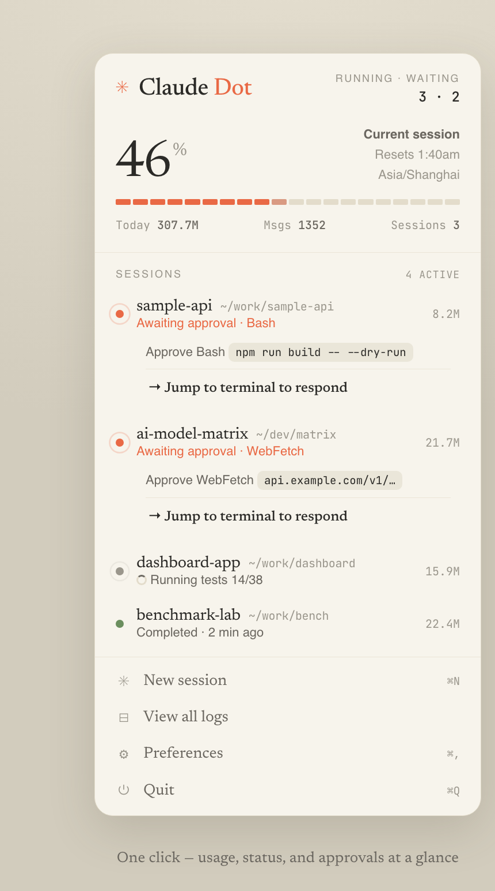
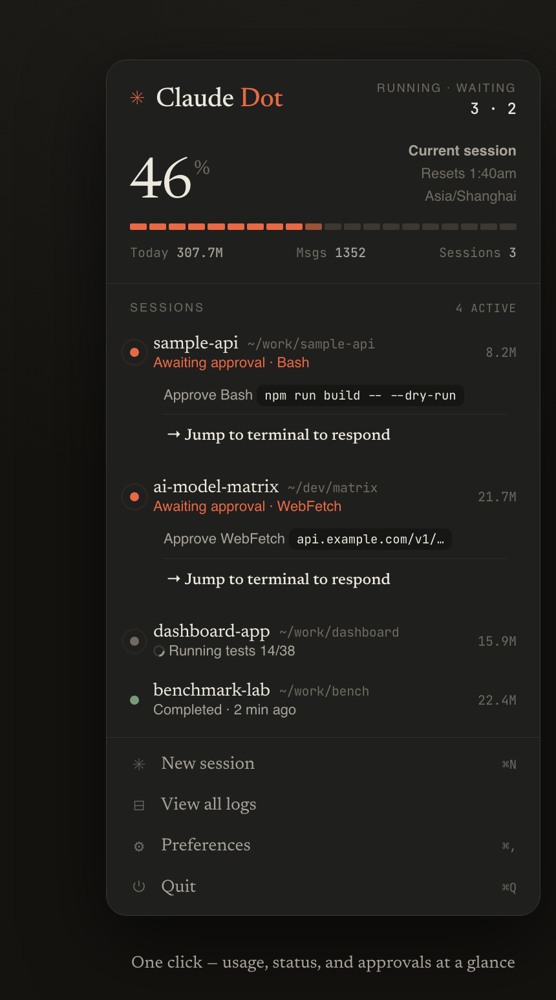
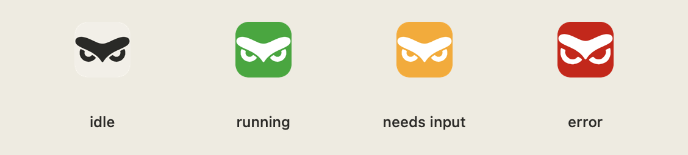
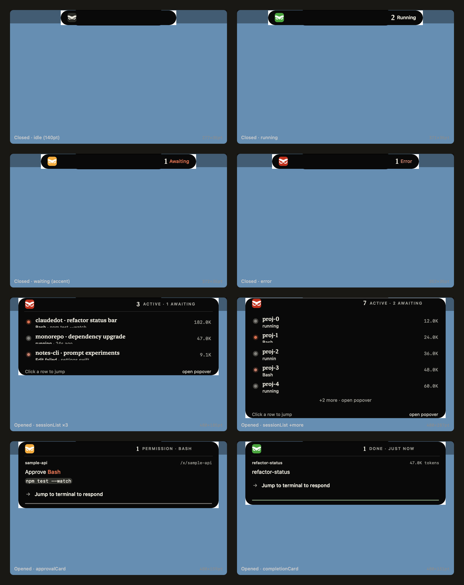

# claudedot

`claudedot` is a native macOS menu-bar app for watching local Claude Code
sessions. The menu-bar icon shows the highest-priority state across every
running session; the popover shows usage, active sessions, pending approvals,
and quick actions to jump back to the terminal that needs attention.

<p align="center">
  
  &nbsp;&nbsp;
  
</p>

It is a small AppKit app built with `swiftc`, no Xcode project and no Swift
package. It runs as an `LSUIElement` background app, reads local Claude Code
state under `~/.claude`, and does not make API calls.

## Features

- Live menu-bar state for all running Claude Code sessions.
- **Dynamic Island** floating in the menu bar — a black capsule that hugs the
  physical notch and shows the highest-priority state + active count at a
  glance, expanding on hover to a per-session list and on hook events to
  contextual cards.
- Popover with current-session usage, today's transcript-derived token totals,
  session rows, status text, and cumulative tokens.
- Pending approval panel showing the tool and command/URL captured by hooks.
- One-click jump back to the exact Terminal/iTerm tab when possible, then the
  owning GUI app, then a new Terminal window at the session folder.
- Theme-aware popover following `design/DESIGN.md`.
- Icon assets generated directly from `design/claudedot-icons.html`, so the
  installed app follows the design source rather than a separate hand-drawn
  implementation.

## Status Icons

The menu-bar icon is a square face. Its color is the aggregate state:

<p align="center">
  
</p>

| State | Priority | Meaning |
| --- | ---: | --- |
| `error` | 3 | A tool call failed recently. |
| `waiting` | 2 | Claude Code is waiting for approval or input. |
| `running` | 1 | Claude Code is actively working. |
| `idle` | 0 | No active work is currently detected. |

`running` decays to `idle` in the aggregate after 90 seconds without a fresh
update. Error state remains visible while recent enough to matter, then native
session recovery wins.

## Dynamic Island

A black floating capsule that lives inside the menu bar, wrapping the physical
notch (or sitting centered on non-notch Macs). It surfaces the most important
status without you having to click anything.

<p align="center">
  
</p>

### Closed state (resting)

A three-segment pill: colored owl on the left, physical-notch placeholder in
the middle, and a compact `{count} {state word}` token on the right.

| State | Right segment | Use the count to know |
| --- | --- | --- |
| `error` | `N Error` (red) | How many sessions have a recent failure |
| `waiting` | `N Awaiting` (accent) | How many sessions are blocked on approval/input |
| `running` | `N Running` (ink) | How many sessions are currently working |
| `idle` | hidden | No active sessions; the pill collapses to just the owl |

The owl glyph color *is* the state — there is no separate pulse dot, since the
glyph carries that information already. Priority is strictly `error > waiting
> running > idle`; only the highest-priority state's count is shown.

### Expanded state (on hover / on event)

Hovering for ≥ 180 ms drops a 480 pt-wide drawer below the pill listing every
non-idle session, with status dot, title, current tool, and cumulative tokens.
Clicking a row calls the same `jump(pid:cwd:)` the popover uses, so you land
in the exact terminal tab that needs you.

Hook events auto-expand into purpose-built cards:

| Hook event | Card | Auto-collapse |
| --- | --- | --- |
| `PreToolUse` | `approvalCard` — tool name, command/URL preview, *Jump to terminal* | 12 s |
| `UserPromptSubmit` / `Notification` | `questionCard` — question text, option preview, *Jump to terminal* | 12 s |
| `Stop` | `completionCard` — task summary, tokens, runtime, *Jump to session* | 6 s |

The island **never** answers a permission prompt on your behalf. It surfaces
the prompt and jumps you to the terminal where Claude Code is waiting.

### Geometry is fully dynamic

Every layout constant is derived from `NSScreen` at runtime — no hardcoded
pixel values — and recomputed on
`NSApplication.didChangeScreenParametersNotification` when you connect or
disconnect an external display:

- **Height** = `menuBarHeight − 2 pt`, so the pill sits at the same height as
  adjacent status items (battery, clock, third-party menu apps) on every
  machine — 14"/16" MBP, M1 Air, Intel Mac alike.
- **Notch-core width** = `realNotchWidth + 24 pt` safety margin, pulled from
  `NSScreen.auxiliaryTopLeftArea / auxiliaryTopRightArea`, so the right-side
  count never falls behind the physical notch.
- **Corner radius** = `height / 2`, so the pill stays a true full-pill capsule
  at any height.
- **Expanded width** is the one fixed value: a hard contract of 480 pt for
  every variant, enforced via `min-width = max-width`.

The full requirement spec lives in
[`design/dynamic-island.html`](design/dynamic-island.html) and tracks 13+
boundary cases (menu-bar auto-hide, Stage Manager, Game Mode, screen
recording, process zombies, atomic state writes, monotonic clock for the 90 s
error decay, and more).

### Disabling

Toggle it off in the popover footer if you only want the menu-bar owl. The
preference is persisted to `UserDefaults` and is independent of the menu-bar
icon and the popover — disabling one does not affect the other.

## How It Works

`claudedot` merges local data sources. Native discovery is the source of truth;
hooks enrich the session record with data Claude Code does not expose in the
native registry.

```text
~/.claude/sessions/<pid>.json
  Claude Code native registry: discovery, pid, cwd, busy/waiting state

~/.claude/statusbar/sessions/<session_id>.json
  claudedot hook state: errors, titles, pending tool/input, recent events

~/.claude/projects/**/<session_id>.jsonl
  transcripts: per-session token totals and today's usage

~/.claude/statusbar/usage.json
  /status Usage tab scrape: current-session percent and reset time
```

The app polls every 1.5 seconds. `mergeSessions` in
`app/Sources/Model.swift` combines native sessions and hook sessions:

- Native sessions drive discovery and base status.
- Native pid liveness is checked with `kill(pid, 0)`, so dead sessions vanish.
- Hook state overlays recent tool errors, prompt-derived titles, and pending
  approval details.
- Hook-only sessions are shown only while recent and non-idle.

Transcript parsing and usage aggregation run on a serial background queue so
opening the popover stays quick.

## Popover

The popover is built in AppKit by
`buildPopover(sessions:stats:theme:handlers:)` in `app/Sources/main.swift`.

It contains:

- Header with running/waiting counts.
- Usage hero showing current-session limit percent and reset time when the
  `/status` probe has data, otherwise today's token total.
- Segmented usage bar.
- Today's tokens, messages, and session count.
- Session rows with status dot, folder, cwd, activity text, and tokens.
- Waiting-state approval panel with the pending tool and captured input.
- Footer actions: New session, View all logs, Preferences, Quit.

While open, the popover only rebuilds when a compact content signature changes.

## Icon Design Pipeline

The visual source of truth for app and status icons is:

```text
design/claudedot-icons.html
```

`scripts/render_icons.js` loads the JavaScript from that HTML file, calls the
same `face(...)` configurations used by the preview page, and renders PNGs with
headless Chrome. `build.sh` then packages those PNGs and creates the app
`ClaudeDot.icns` with `iconutil`.

Generated resources inside the app bundle:

```text
Contents/Resources/ClaudeDot.png
Contents/Resources/ClaudeDot.icns
Contents/Resources/StatusRunning.png
Contents/Resources/StatusWaiting.png
Contents/Resources/StatusError.png
Contents/Resources/StatusIdleLight.png
Contents/Resources/StatusIdleDark.png
```

At runtime, `app/Sources/main.swift` loads these bundled PNGs first. The Swift
vector fallback exists only so snapshot/debug paths do not go blank if assets
are missing.

## Commands

```bash
./run_tests.sh
./build.sh
./install.sh
./uninstall.sh
```

What they do:

| Command | Purpose |
| --- | --- |
| `./run_tests.sh` | Runs Python hook tests and Swift model tests. |
| `./build.sh` | Builds `build/claudedot.app`, generates icon PNGs, creates `ClaudeDot.icns`, and signs ad hoc. |
| `./install.sh` | Builds, installs to `~/Applications/claudedot.app`, installs hook scripts, merges settings, registers and starts the LaunchAgent. |
| `./uninstall.sh` | Stops the LaunchAgent, removes the app, removes claudedot hooks, and removes the usage probe. |

`./install.sh` also removes an older `~/Applications/ClaudeStatusBar.app` if it
exists.

## Requirements

- macOS 12 or newer.
- Swift toolchain with `swiftc`.
- `python3`.
- Node.js.
- Google Chrome, Chromium, or Microsoft Edge for icon rendering during build.
- Claude Code CLI available as `claude` for the usage probe and New Session
  action.

The app itself has no network dependency. Chrome is only used at build time to
render icon assets from the HTML design file.

## Install

```bash
./install.sh
```

The installer:

1. Builds `build/claudedot.app`.
2. Copies hook scripts to `~/.claude/statusbar`.
3. Installs the app to `~/Applications/claudedot.app`.
4. Merges lifecycle hooks into `~/.claude/settings.json`.
5. Writes and starts `~/Library/LaunchAgents/com.claudecode.statusbar.plist`.

Hook installation is tagged with `_tag: "cc-statusbar"` so uninstall removes
only the hooks this project added. Existing user hooks are preserved. A
`~/.claude/settings.json.statusbar-bak` backup is written before modifications.

Hooks take effect for Claude Code sessions started after installation.

The first time you use jump-to-session, macOS may ask for Automation permission
so claudedot can focus Terminal or iTerm.

## Uninstall

```bash
./uninstall.sh
```

This removes:

- `~/Applications/claudedot.app`
- any old `~/Applications/ClaudeStatusBar.app`
- `~/Library/LaunchAgents/com.claudecode.statusbar.plist`
- hook entries tagged `_tag: "cc-statusbar"`
- `~/.claude/statusbar/cc_usage_probe.py`
- `~/.claude/statusbar/usage.json`
- `~/.claude/statusbar/probe`

It leaves `~/.claude/statusbar/sessions` in place.

## Development

Run tests:

```bash
./run_tests.sh
```

Build:

```bash
./build.sh
```

Render preview images from the built binary:

```bash
BIN=build/claudedot.app/Contents/MacOS/claudedot

"$BIN" --snapshot out.png                        # popover (light + dark, demo data)
"$BIN" --snapshot out.png --real                 # popover with live session data
"$BIN" --snapshot-island docs/screenshot-island.png  # Dynamic Island: closed × 4 + expanded variants
"$BIN" --owls docs/screenshot-states.png         # menu-bar owl glyph states
"$BIN" --appicon /tmp/claudedot-appicon.png      # app icon
```

All snapshot modes render offscreen via `NSView.cacheDisplay`, so no Screen
Recording permission is needed.

Preview the icon design source directly:

```bash
python3 -m http.server 8765 -d design
open http://127.0.0.1:8765/claudedot-icons.html
```

Preview the popover HTML mock:

```bash
open design/claudedot.html
```

## Tests

The project uses tiny custom test runners, not `pytest` or XCTest.

Python tests:

```bash
python3 tests/test_hook.py
```

Swift model tests are staged by `run_tests.sh`. It copies
`app/tests/model_test.swift` to a temporary `main.swift` because Swift top-level
test code must live in a file named `main.swift`, then compiles it with
`app/Sources/Model.swift`.

## Repository Layout

| Path | Purpose |
| --- | --- |
| `app/Sources/Model.swift` | Pure model, status mapping, merge logic, aggregation, token helpers. No AppKit. |
| `app/Sources/main.swift` | AppKit app, menu-bar item, popover, data loading, usage parsing, jump-to-session, snapshot modes. |
| `app/Sources/DynamicIsland.swift` | Dynamic Island controller — `NSScreen`-derived geometry, three-segment pill, hover & event-driven expanded variants. |
| `design/dynamic-island.html` | Dynamic Island requirement spec (v0.4) — form factor, geometry, boundary cases, acceptance criteria. |
| `hook/cc_statusbar_hook.py` | Claude Code hook dispatcher. Writes per-session JSON state. |
| `hook/cc_usage_probe.py` | Drives Claude Code `/status` in a pseudo-terminal and writes `usage.json`. |
| `install_hooks.py` | Idempotent merge/removal for `~/.claude/settings.json` hooks. |
| `scripts/render_icons.js` | Generates app/status icon PNGs from `design/claudedot-icons.html`. |
| `design/DESIGN.md` | Popover visual system. |
| `design/claudedot.html` | Popover HTML mock. |
| `design/claudedot-icons.html` | Icon design source of truth. |
| `tests/test_hook.py` | Python hook tests. |
| `app/tests/model_test.swift` | Swift model tests. |
| `build.sh` | Builds the app bundle. |
| `install.sh` | Installs and starts claudedot. |
| `uninstall.sh` | Removes installed files and hooks. |

## Hook Contract

`hook/cc_statusbar_hook.py` must never break Claude Code:

- It exits `0` on every error.
- It writes nothing to stdout.
- It performs no network calls.
- It writes state atomically.

The important pure function is `compute_update(payload, prev)`. Add behavior
there first, then cover it in `tests/test_hook.py`.

Shared hook state keys include:

```text
session_id
cwd
folder
status
title
last_event
last_error
error_at
updated_at
pending_tool
pending_input
ended
```

If a key changes, update both the Python hook and `Session.init?(json:)` in
`Model.swift`.

## Usage Data

Per-session token totals are read from transcripts:

```text
~/.claude/projects/<encoded-cwd>/<session_id>.jsonl
```

`tokensFor(id)` reads transcripts incrementally and caches byte offsets because
transcripts append.

Today's usage is derived from transcript lines modified recently. The app does
not trust `~/.claude/stats-cache.json` for current daily usage because it can be
stale.

Subscription limit data comes from Claude Code's `/status` TUI. There is no
JSON CLI for that view, so `hook/cc_usage_probe.py` opens Claude Code in a
pseudo-terminal, sends `/status`, switches to the Usage tab, scrapes the text,
and writes:

```text
~/.claude/statusbar/usage.json
```

The probe runs in `~/.claude/statusbar/probe`, and the app filters that scratch
session out of the session list.

## Jump To Session

Clicking a row or approval action calls `jump(pid:cwd:)`.

Resolution order:

1. Find the process tty and select the matching Terminal.app or iTerm2 tab with
   AppleScript.
2. Walk the process tree to the first regular GUI app and activate it.
3. Open Terminal at the session cwd.

The app cannot answer Claude Code permission prompts itself; it takes you to the
terminal where the prompt is waiting.

## Notes And Limitations

- The native registry path is currently `~/.claude/sessions`.
- The app name is `claudedot`, but several internal identifiers still use the
  historical bundle id `com.claudecode.statusbar`.
- Usage limit scraping is fragile because it depends on Claude Code TUI labels
  and tab order. If the usage hero goes blank, check `hook/cc_usage_probe.py`.
- `/status` usage is local-machine usage, not a global account total across all
  devices.
- Cost is intentionally not shown because the probe's throwaway session can make
  the reported cost misleading.
- Headless `claude -p` sessions may not appear in the native registry; recent
  active hook-only sessions are shown briefly.
- Live menu-bar screenshots can require macOS Screen Recording permission. Use
  `--snapshot`, `--snapshot-island`, `--owls`, and `--appicon` for offscreen
  previews.
- The Dynamic Island is rendered on the built-in display only — it is not
  mirrored to external monitors. Connecting or disconnecting an external
  display triggers a geometry recompute (height, notch-core width, centering)
  without restarting the app.

## License

MIT. See [LICENSE](LICENSE).
